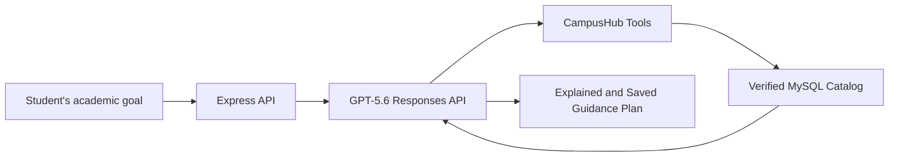

# CampusHub

**CampusHub** is an academic guidance and campus-life platform designed for the Democratic Republic of the Congo.

It connects students, visitors, educational institutions, and administrators through:

- a verified academic catalog;
- a university social network;
- an AI-powered academic guidance assistant;
- an institutional copilot powered by GPT-5.6.

---

## CampusHub AI

The academic guidance assistant transforms a student’s educational goals into clear, personalized, and traceable recommendations.

It works as follows:

- GPT-5.6 considers the student’s study goals, budget, academic level, and mobility constraints;
- the model’s tools search exclusively through verified programs stored in MySQL;
- tuition fees, campuses, programs, and admission requirements are never invented by the model;
- a report-card image can be analyzed using GPT-5.6 vision capabilities and then confirmed by the user;
- every response and its supporting sources are saved in a personal academic guidance file;
- when no OpenAI API key is available, a clearly identified MySQL-based demonstration mode remains accessible.

The academic guidance assistant is available to registered visitors and students.

Educational institutions use a separate institutional copilot that can:

- prepare publication drafts;
- present academic programs;
- clarify admission requirements;
- review the quality and completeness of an institution’s profile.

For security and editorial control, the institutional copilot never publishes content automatically.



---

## Architecture

```text
CampusHub/
├── backend/    # Express REST API, OpenAI SDK, JWT, Zod, tests, and evaluations
├── database/   # MySQL, triggers, stored procedures, views, and demo data
└── frontend/   # React/Vite, role-based spaces, and the CampusHub AI interface
```

The backend follows this structure:

`Route → Middleware → Controller → Service → MySQL/OpenAI`

This organization keeps the code easy to understand, maintain, test, and debug.

---

## Local Installation

### Requirements

Before installing CampusHub, make sure you have:

- Node.js 20 or later;
- MySQL 8 or later;
- an OpenAI API key to activate GPT-5.6 mode.

### 1. Set up the database

Run the scripts located in the `database` directory in order, from `01` to `18`.

The demonstration scripts contain only fictional institutions that are clearly identified as demonstration data.

### 2. Configure and start the backend

```powershell
cd backend
Copy-Item .env.example .env
npm install
npm run dev
```

### 3. Configure the environment variables

In `backend/.env`, provide at least the MySQL and OpenAI configuration:

```dotenv
DB_HOST=localhost
DB_PORT=3306
DB_USER=root
DB_PASSWORD=your_password
DB_NAME=campushub
OPENAI_API_KEY=your_openai_api_key
OPENAI_MODEL=gpt-5.6-luna
```

### 4. Start the frontend

```powershell
cd frontend
Copy-Item .env.example .env
npm install
npm run dev
```

The services will be available at:

- **Frontend:** `http://127.0.0.1:5173`
- **API:** `http://localhost:4000/api/v1`

---

## Demonstration and Verification

Run the following commands to install the AI demonstration data, evaluate the academic guidance system, and verify the project:

```powershell
cd backend
npm run db:demo-ai
npm run eval:orientation
npm run check
npm test

cd ../frontend
npm run lint
npm run build
```

The automated evaluation covers five scenarios:

1. information technology;
2. health studies;
3. business and management;
4. a required city;
5. an unavailable academic field.

The evaluation also verifies that institutions that have not been approved are never included in the recommendations.

### Main Academic Guidance Routes

| Method | Route | Purpose |
|---|---|---|
| `GET` | `/api/v1/orientation/configuration` | Check whether GPT-5.6 or demonstration mode is active |
| `POST` | `/api/v1/orientation/recommandations` | Create and save an academic guidance plan |
| `POST` | `/api/v1/orientation/analyser-bulletin` | Analyze a report-card image with GPT-5.6 |
| `GET` | `/api/v1/orientation/dossiers` | Retrieve the user’s academic guidance history |
| `POST` | `/api/v1/copilote-institution/generer` | Generate an institutional content draft |
| `GET` | `/api/v1/copilote-institution/historique` | Retrieve an institution’s generated drafts |

All these routes require authentication and are protected according to the user’s role.

To test the platform:

- create a visitor or student account to use the academic guidance assistant;
- use an institution account to access the institutional copilot.

---

## OpenAI Build Week

The technical decisions, video demonstration scenario, evaluation results, and submission checklist are available in:

[`BUILD_WEEK.md`](BUILD_WEEK.md)

CampusHub is released under the **MIT License**.

---

# CampusHub Demo Accounts

## Live Application

[Open the CampusHub demonstration](https://13-63-171-109.nip.io)

> **Important:** These accounts are intended exclusively for testing and demonstrations.  
> The 20 associated educational institutions are fictional and must not be used in production with real personal data.

## Shared Demo Password

```text
CampusHubDemo!2026
```

---

## Administrator Account

| Profile | Email Address |
|---|---|
| CampusHub Administrator | `admin@campushub.test` |

---

## Higher Education Demo Accounts

| Fictional Institution | Email Address |
|---|---|
| Great Lakes Demonstration University | `universite01@campushub.test` |
| Demonstration Institute of Technology | `universite02@campushub.test` |
| Kinshasa Demonstration University | `universite03@campushub.test` |
| Kasai Demonstration Academy of Health Sciences | `universite04@campushub.test` |
| Katanga Demonstration Institute of Agronomy | `universite05@campushub.test` |
| Congo River Demonstration University | `universite06@campushub.test` |
| Bunia Demonstration Institute of Management | `universite07@campushub.test` |
| Matadi Demonstration University of Sciences | `universite08@campushub.test` |
| Kisangani Demonstration Teacher Training Institute | `universite09@campushub.test` |
| Equateur Demonstration University | `universite10@campushub.test` |

---

## Secondary School Demo Accounts

| Fictional School | Email Address |
|---|---|
| Amani Demonstration School Complex | `secondaire01@campushub.test` |
| Kivu Demonstration High School | `secondaire02@campushub.test` |
| Lumière Demonstration College | `secondaire03@campushub.test` |
| Salama Demonstration Technical Institute | `secondaire04@campushub.test` |
| Umoja Demonstration Secondary School | `secondaire05@campushub.test` |
| Congo River Demonstration College | `secondaire06@campushub.test` |
| Tshopo Demonstration High School | `secondaire07@campushub.test` |
| Espoir Demonstration School Complex | `secondaire08@campushub.test` |
| Mbandaka Demonstration Secondary Institute | `secondaire09@campushub.test` |
| South Ubangi Demonstration College | `secondaire10@campushub.test` |

---

## Quick Verification

1. Open the CampusHub login page.
2. Enter one of the email addresses listed above.
3. Use the shared demonstration password.
4. The administrator account will open the administration dashboard.
5. Each institutional account will open its corresponding institution workspace.

---

## Detailed Documentation

- [Backend documentation](backend/README.md)
- [Database documentation](database/README.md)
- [API documentation](backend/docs/API.md)

---

## AWS Deployment

The [`deploy/aws-lightsail`](deploy/aws-lightsail/README.md) directory contains a reproducible demonstration deployment based on:

- an AWS Lightsail instance;
- MySQL 8.4;
- persistent storage volumes;
- automatic HTTPS configuration;
- preconfigured demonstration accounts;
- a cleanup command for removing the deployment after the competition.

This deployment configuration makes it possible to reproduce and test the CampusHub demonstration environment consistently.
