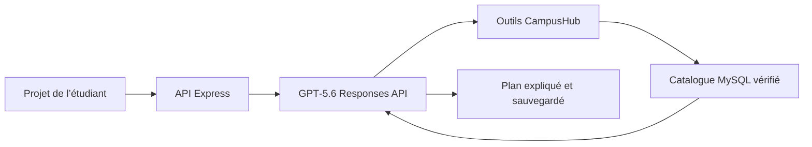

# CampusHub

CampusHub est une plateforme d’orientation et de vie académique pensée pour la RDC. Elle relie étudiants, visiteurs, établissements et administrateurs autour d’un catalogue vérifié, d’un réseau social universitaire, d’un conseiller d’orientation et d’un copilote institutionnel assistés par GPT‑5.6.

## CampusHub AI

Le conseiller transforme un objectif d’études en recommandations traçables :

- GPT‑5.6 raisonne sur le projet, le budget, le niveau et la mobilité de l’étudiant ;
- les outils du modèle interrogent exclusivement les formations vérifiées dans MySQL ;
- les frais, campus et conditions ne sont jamais inventés par le modèle ;
- une photo de bulletin peut être analysée par la vision de GPT‑5.6, puis confirmée par l’utilisateur ;
- chaque réponse et ses sources sont sauvegardées dans un dossier d’orientation ;
- sans clé OpenAI, un mode démonstration MySQL reste utilisable et est clairement signalé.

Le conseiller d’orientation est réservé aux visiteurs inscrits et aux étudiants. Les universités disposent d’un copilote différent qui prépare des brouillons de publications, présente les filières, clarifie les admissions et audite la qualité de leur fiche. Il ne publie jamais automatiquement.



## Architecture

```text
CampusHub/
├── backend/    # API REST Express, OpenAI SDK, JWT, Zod et évaluations
├── database/   # MySQL, triggers, procédures, vues et données de démonstration
└── frontend/   # React/Vite, espaces par rôle et interface CampusHub AI
```

Le backend suit le chemin `route → middleware → controller → service → MySQL/OpenAI` pour rester simple à lire et à déboguer.

## Installation locale

Prérequis : Node.js 20+, MySQL 8+ et une clé API OpenAI pour le mode GPT‑5.6.

1. Exécuter les scripts du dossier `database` dans l’ordre `01` à `18`. Les scripts de démonstration contiennent uniquement des établissements fictifs explicitement nommés comme tels.
2. Configurer et lancer l’API :

```powershell
cd backend
Copy-Item .env.example .env
npm install
npm run dev
```

3. Dans `backend/.env`, renseigner au minimum MySQL et OpenAI :

```dotenv
DB_HOST=localhost
DB_PORT=3306
DB_USER=root
DB_PASSWORD=votre_mot_de_passe
DB_NAME=campushub
OPENAI_API_KEY=votre_cle_api
OPENAI_MODEL=gpt-5.6-luna
```

4. Lancer l’interface :

```powershell
cd frontend
Copy-Item .env.example .env
npm install
npm run dev
```

Frontend : `http://127.0.0.1:5173` — API : `http://localhost:4000/api/v1`.

## Démonstration et vérification

```powershell
cd backend
npm run db:demo-ai
npm run eval:orientation
npm run check
npm test

cd ../frontend
npm run lint
npm run build
```

L’évaluation couvre cinq cas : informatique, santé, gestion, ville imposée et domaine absent. Elle vérifie également qu’aucun établissement non validé ne remonte dans les résultats.

Routes principales du conseiller :

| Méthode | Route | Usage |
|---|---|---|
| GET | `/api/v1/orientation/configuration` | Mode GPT‑5.6 ou démonstration |
| POST | `/api/v1/orientation/recommandations` | Créer et sauvegarder un plan |
| POST | `/api/v1/orientation/analyser-bulletin` | Analyser une image avec GPT‑5.6 |
| GET | `/api/v1/orientation/dossiers` | Retrouver son historique |
| POST | `/api/v1/copilote-institution/generer` | Créer un brouillon institutionnel |
| GET | `/api/v1/copilote-institution/historique` | Retrouver les brouillons de l’université |

Toutes ces routes sont authentifiées et séparées par rôle. Créez un compte visiteur ou étudiant pour essayer l’orientation, ou un compte université pour utiliser le copilote établissement.

## OpenAI Build Week

Les choix techniques, le scénario vidéo, les évaluations et la liste de contrôle de soumission se trouvent dans [BUILD_WEEK.md](BUILD_WEEK.md). Le projet est publié sous licence MIT.

# Comptes de démonstration CampusHub

Application : [https://13-63-171-109.nip.io](https://13-63-171-109.nip.io)

Ces comptes sont uniquement destinés aux tests et aux présentations. Les 20 établissements associés sont fictifs. Ils ne doivent pas être utilisés en production avec des données personnelles réelles.

## Mot de passe commun

`CampusHubDemo!2026`

## Administration

| Profil | Adresse e-mail |
|---|---|
| Administrateur CampusHub | `admin@campushub.test` |

## 10 établissements supérieurs

| Établissement fictif | Adresse e-mail |
|---|---|
| Université Démonstration des Grands Lacs | `universite01@campushub.test` |
| Institut Supérieur Démonstration de Technologie | `universite02@campushub.test` |
| Université Démonstration de Kinshasa | `universite03@campushub.test` |
| Académie Démonstration de Santé du Kasaï | `universite04@campushub.test` |
| Institut Démonstration d’Agronomie du Katanga | `universite05@campushub.test` |
| Université Démonstration du Fleuve Congo | `universite06@campushub.test` |
| Institut Démonstration de Gestion de Bunia | `universite07@campushub.test` |
| Université Démonstration des Sciences de Matadi | `universite08@campushub.test` |
| Institut Démonstration Pédagogique de Kisangani | `universite09@campushub.test` |
| Université Démonstration de l’Équateur | `universite10@campushub.test` |

## 10 écoles secondaires

| École fictive | Adresse e-mail |
|---|---|
| Complexe Scolaire Démonstration Amani | `secondaire01@campushub.test` |
| Lycée Démonstration du Kivu | `secondaire02@campushub.test` |
| Collège Démonstration Lumière | `secondaire03@campushub.test` |
| Institut Technique Démonstration Salama | `secondaire04@campushub.test` |
| École Secondaire Démonstration Umoja | `secondaire05@campushub.test` |
| Collège Démonstration du Fleuve | `secondaire06@campushub.test` |
| Lycée Démonstration de la Tshopo | `secondaire07@campushub.test` |
| Complexe Scolaire Démonstration Espoir | `secondaire08@campushub.test` |
| Institut Secondaire Démonstration Mbandaka | `secondaire09@campushub.test` |
| Collège Démonstration du Sud-Ubangi | `secondaire10@campushub.test` |

## Vérification rapide

1. Ouvrir la page de connexion.
2. Utiliser l’une des adresses ci-dessus et le mot de passe commun.
3. Le compte administrateur ouvre l’administration ; chaque compte institutionnel ouvre son espace établissement.


Documentation détaillée : [backend](backend/README.md) · [base de données](database/README.md) · [API](backend/docs/API.md).

## Déploiement AWS

Le dossier [`deploy/aws-lightsail`](deploy/aws-lightsail/README.md) contient un déploiement de démonstration reproductible : instance Lightsail, MySQL 8.4, volumes persistants, HTTPS automatique, comptes de test et commande de suppression après le concours.
