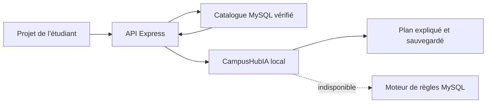

# CampusHub

CampusHub est une plateforme d’orientation et de vie académique pensée pour la RDC. Elle relie étudiants, visiteurs, établissements et administrateurs autour d’un catalogue vérifié, d’un réseau social éducatif, d’un conseiller d’orientation et d’un copilote institutionnel.

Chaque nouveau compte institutionnel confirmé bénéficie d’un essai gratuit unique de 30 jours. La continuité du service repose ensuite sur deux formules : une tranche annuelle renouvelable de 20 USD ou un paiement unique de 200 USD pour un accès à vie.

## CampusHubIA

CampusHubIA est notre propre agent local. Il fonctionne sans API de modèle d’IA externe et transforme un projet d’études en recommandations traçables :

- le corpus est construit à partir des données publiques et vérifiées de CampusHub ;
- MySQL fournit en direct les formations, frais, campus et conditions ;
- le moteur comprend les échanges courants et corrige les fautes de frappe proches du vocabulaire académique ;
- pour une question générale absente du corpus, Express peut consulter Wikipédia et affiche toujours les liens utilisés ;
- chaque recommandation conserve ses sources et son score de compatibilité ;
- les réponses et leur mode d’exécution sont sauvegardés dans le dossier d’orientation ;
- si le service Python redémarre, un moteur de règles MySQL prend automatiquement le relais.

Les visiteurs inscrits et les étudiants utilisent le conseiller d’orientation. Les établissements disposent d’un copilote distinct pour préparer des brouillons de publications, présenter les filières, clarifier les admissions et vérifier la qualité de leur fiche. Le copilote ne publie jamais automatiquement.



## Architecture

```text
CampusHub/
├── backend/      # API REST Express, JWT, Zod, MySQL et client CampusHubIA
├── database/     # MySQL, triggers, procédures, vues et migrations
├── frontend/     # React/Vite et espaces par rôle
└── My Agent/     # Service Python CampusHubIA, corpus et entraînement local
```

Le backend suit le chemin `route → middleware → controller → service → MySQL/CampusHubIA` pour rester simple à lire et à déboguer. Le service IA n’est pas exposé publiquement en production ; Express l’appelle sur le réseau Docker privé avec un jeton interne.

## Installation locale

Prérequis : Node.js 20+, Python 3.12+ et MySQL 8+.

1. Exécuter les scripts du dossier `database` dans l’ordre `01` à `30`.
2. Configurer et lancer l’API :

```powershell
cd backend
Copy-Item .env.example .env
npm install
npm run dev
```

3. Synchroniser et lancer CampusHubIA :

```powershell
cd "..\My Agent"
.\venv\Scripts\python.exe sync_campushub_data.py --api-url http://127.0.0.1:4000/api/v1
.\venv\Scripts\python.exe server.py
```

4. Lancer l’interface :

```powershell
cd ..\frontend
Copy-Item .env.example .env
npm install
npm run dev
```

Frontend : `http://127.0.0.1:5173` — API : `http://127.0.0.1:4000/api/v1` — CampusHubIA : `http://127.0.0.1:5000`.

## Vérification

```powershell
cd "My Agent"
.\venv\Scripts\python.exe -m unittest discover -s tests -v

cd ..\backend
npm run check
npm test

cd ..\frontend
npm run lint
npm run build
```

Routes principales de CampusHubIA :

| Méthode | Route | Usage |
|---|---|---|
| POST | `/api/v1/assistant/question` | Interroger le bot disponible sur le site, hors connexion |
| GET | `/api/v1/orientation/configuration` | État de CampusHubIA et du moteur de secours |
| POST | `/api/v1/orientation/recommandations` | Créer et sauvegarder un plan |
| GET | `/api/v1/orientation/dossiers` | Retrouver son historique |
| POST | `/api/v1/orientation/finalistes/recommandations` | Orienter un finaliste |
| POST | `/api/v1/copilote-institution/generer` | Créer un brouillon institutionnel |
| GET | `/api/v1/copilote-institution/historique` | Retrouver les brouillons de l’établissement |

Le bot de l’accueil est public et limité en fréquence. Les autres routes sont authentifiées et séparées par rôle.

Documentation détaillée : [CampusHubIA](My%20Agent/README.md) · [backend](backend/README.md) · [base de données](database/README.md) · [API](backend/docs/API.md) · [déploiement VPS](deploy/vps-ubuntu/README.md).
